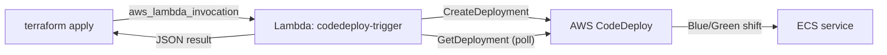

<div align="center">
  

  <h1>aws-lambda-codedeploy-trigger</h1>

  <p>
    <strong>Trigger AWS CodeDeploy from <code>terraform apply</code> — synchronously.</strong>
  </p>

  <p>
    <a href="https://github.com/dmitryint/aws-lambda-codedeploy-trigger/actions/workflows/test.yml"></a>
    <a href="https://github.com/dmitryint/aws-lambda-codedeploy-trigger/releases/latest"></a>
    <a href="https://goreportcard.com/report/github.com/dmitryint/aws-lambda-codedeploy-trigger"></a>
    <a href="https://github.com/dmitryint/aws-lambda-codedeploy-trigger/blob/main/LICENSE"></a>
    
    
  </p>
</div>

---

## Why this exists

Terraform can create CodeDeploy applications and deployment groups, but **it cannot start a deployment**. With ECS Blue/Green that means changing your task definition in Terraform leaves the live service untouched until somebody manually clicks *Deploy*. There is no `aws_codedeploy_deployment` resource and `aws_ecs_service` with the `CODE_DEPLOY` controller will not roll out new task revisions on its own.

This Lambda closes the loop:

1. Terraform builds the new task definition / AppSpec.
2. `aws_lambda_invocation` calls this Lambda with the AppSpec.
3. The Lambda creates a CodeDeploy deployment and **waits** until it Succeeds or Fails.
4. `terraform apply` blocks until the deployment finishes — success or non-zero exit.



## Features

- Synchronous: blocks `terraform apply` until the deployment reaches a terminal state.
- Returns structured JSON (`deploymentId`, `status`, timestamps) — readable from `aws_lambda_invocation.<name>.result`.
- Optional fire-and-forget mode (`wait: false`).
- Configurable poll interval (`POLL_INTERVAL_SECONDS`).
- Forwards every CodeDeploy `CreateDeployment` knob you commonly need: description, auto-rollback, ignore application stop failures.
- Single static binary, `provided.al2023` runtime, ~5 MB zipped, supports `arm64` and `x86_64`.

## Quick start (Terraform + ECS Blue/Green)

The exact pattern this project is designed for:

```hcl
locals {
  appspec = {
    version = "0.0"
    Resources = [{
      TargetService = {
        Type = "AWS::ECS::Service"
        Properties = {
          TaskDefinition = module.ecs_service.task_definition_arn
          LoadBalancerInfo = {
            ContainerName = local.container_name
            ContainerPort = local.container_port
          }
          PlatformVersion = "LATEST"
        }
      }
    }]
  }
}

resource "aws_lambda_invocation" "deploy" {
  function_name = var.codedeploy_lambda_function_name

  input = jsonencode({
    applicationName     = module.code_deploy.name
    deploymentGroupName = module.code_deploy.name
    revision = {
      revisionType = "AppSpecContent"
      appSpecContent = {
        content = jsonencode(local.appspec)
        sha256  = sha256(jsonencode(local.appspec))
      }
    }
  })

  triggers = {
    task_definition_arn = module.ecs_service.task_definition_arn
  }

  depends_on = [
    module.code_deploy,
    module.ecs_service,
    module.alb_ingress,
  ]
}

output "deployment_id" {
  value = jsondecode(aws_lambda_invocation.deploy.result).deploymentId
}
```

End-to-end runnable examples:

- [`examples/terraform/`](examples/terraform) — provision the Lambda function from a release artifact.
- [`examples/terraform-ecs-blue-green/`](examples/terraform-ecs-blue-green) — full ECS Blue/Green flow.

## Event schema

The handler accepts a JSON object whose keys match the AWS CodeDeploy `CreateDeployment` API in lower-camel-case.

| Field | Type | Required | Description |
|---|---|---|---|
| `applicationName` | string | yes | CodeDeploy application name. |
| `deploymentGroupName` | string | yes | CodeDeploy deployment group name. |
| `revision` | object | yes | A standard CodeDeploy [`RevisionLocation`](https://docs.aws.amazon.com/codedeploy/latest/APIReference/API_RevisionLocation.html). For ECS Blue/Green use `revisionType: "AppSpecContent"`. |
| `description` | string | no | Description attached to the deployment. |
| `ignoreApplicationStopFailures` | bool | no | Forwarded to `CreateDeployment`. |
| `autoRollbackConfiguration` | object | no | CodeDeploy [`AutoRollbackConfiguration`](https://docs.aws.amazon.com/codedeploy/latest/APIReference/API_AutoRollbackConfiguration.html). |
| `wait` | bool | no | Default `true`. Set to `false` to return immediately after `CreateDeployment` without polling. |

## Result schema

```json
{
  "deploymentId": "d-XXXXXXXXX",
  "status": "Succeeded",
  "createdAt": "2026-05-09T10:00:00Z",
  "completedAt": "2026-05-09T10:05:30Z"
}
```

A failed deployment returns the same shape **plus** a non-empty `errorMessage` field on the Lambda invocation, which causes `aws_lambda_invocation` to fail the Terraform run.

## Configuration

| Env var | Default | Description |
|---|---|---|
| `POLL_INTERVAL_SECONDS` | `15` | Interval between `GetDeployment` polls. Lower it for faster feedback on small deployments. |

The AWS region is taken from the standard Lambda environment — no extra variables required.

## IAM policy for the Lambda role

```json
{
  "Version": "2012-10-17",
  "Statement": [
    {
      "Effect": "Allow",
      "Action": [
        "codedeploy:CreateDeployment",
        "codedeploy:GetDeployment",
        "codedeploy:GetDeploymentConfig",
        "codedeploy:RegisterApplicationRevision"
      ],
      "Resource": "*"
    },
    {
      "Effect": "Allow",
      "Action": "iam:PassRole",
      "Resource": "arn:aws:iam::*:role/<codedeploy-service-role>"
    }
  ]
}
```

Plus the standard `AWSLambdaBasicExecutionRole` for CloudWatch Logs.

## Known constraints

- **AWS Lambda hard limit of 15 minutes.** If your deployment can take longer (large fleets, slow Blue/Green traffic shifts), either tune CodeDeploy `wait_time_in_minutes` and the deployment configuration to fit, or invoke the Lambda with `wait: false` and poll deployment status from elsewhere.
- `aws_lambda_invocation` re-runs on **every** change to its `triggers` map. Keep `triggers` precise (e.g. `task_definition_arn`) to avoid spurious deployments.

## Releases

Each tagged GitHub Release ships two ready-to-use Lambda zip artifacts:

- `lambda-codedeploy-trigger_<version>_linux_amd64.zip`
- `lambda-codedeploy-trigger_<version>_linux_arm64.zip`

Pin a version in your Terraform config and download via `archive_file`, `null_resource` + `curl`, or by uploading to S3.

## Building from source

```sh
git clone https://github.com/dmitryint/aws-lambda-codedeploy-trigger.git
cd aws-lambda-codedeploy-trigger
make package          # builds amd64 + arm64 zips into ./package
make test             # runs unit tests with -race
```

## Contributing

Issues and pull requests are welcome. See [CONTRIBUTING.md](CONTRIBUTING.md) for the development workflow, coding conventions, and PR checklist.

## License

[MIT](LICENSE) © 2026 Dmitry K.
